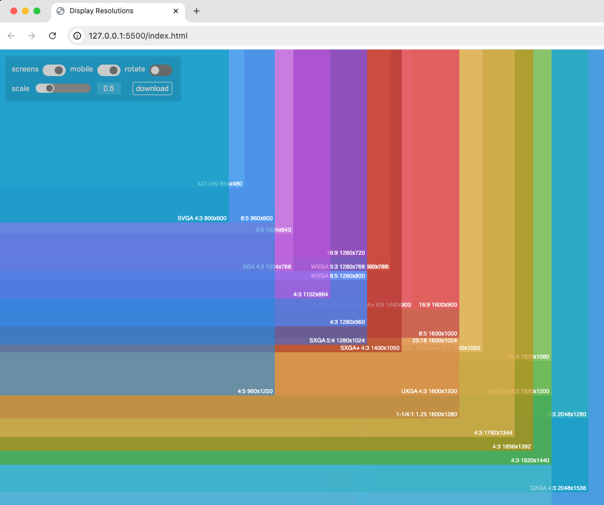
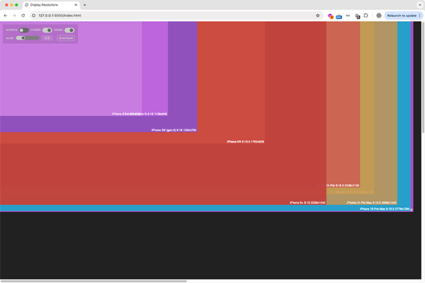

# Display Resolutions

<!--  -->

## References

- https://iosref.com/res
- https://www.figma.com/community/file/905537113759977194/the-periodic-table-of-iphone-screen-sizes
- https://web.archive.org/web/20171108190059/http://www.latenighthacking.com/projects/monitorResolutions.html
- https://www.david-smith.org/blog/2014/01/09/visualizing-display-resolutions/
- https://www.logicalincrements.com/resolution
- https://en.wikipedia.org/wiki/List_of_common_display_resolutions
- https://toolstud.io/photo/megapixel.php
- https://www.ios-resolution.com/

## Calculators

- https://insaneimpact.com/aspect-ratio-calculator/
- https://aspectratiocalculator.com/
- https://www.digitalrebellion.com/webapps/aspectcalc